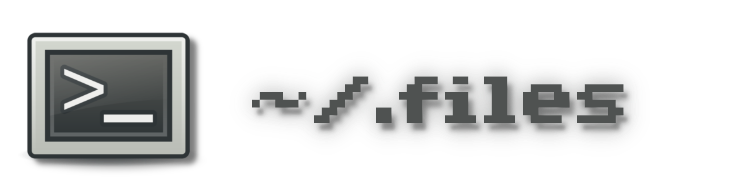

<p align="center">

</p>
<p align="center"><i>Files that makes me feel at <tt>~/</tt>!</i></p>

# Dotfiles
[](#)
[](#)
<br>
[](#)
[](#)
[](#)

My personal dotfiles, installed and managed with [dotbot](https://github.com/anishathalye/dotbot).

## Highlights
* [`.config/`](.config/) - I've spent quite some effort to make my dotfiles adhere to the [XDG](https://specifications.freedesktop.org/basedir-spec/basedir-spec-latest.html) Base Directory Standard as much as possible, using and contributing to the [Arch wiki page](https://wiki.archlinux.org/title/XDG_Base_Directory). As far from all programs that I use support this natively, quite some custom configuration neeeded to be done. Grep for `XDG` in [shell/commons](.config/shell/commons).
   * [`dotbot/install.conf.yaml`](.config/dotbot/install.conf.yaml) - how these dotfiles are installed.
   * [`nvim/`](.config/nvim) - check out my Neovim configurations; they are pretty cool!
* [`bin/`](bin/) - many handy and time saving scripts.
  * [`brew_upgrade.sh`](bin/brew_upgrade.sh) - interactively upgrade a Homebrew system.
  * [`macos_touchid_sudo_enable.sh`](bin/macos_touchid_sudo_enable.sh) - enable sudo with TouchID.
  * [`pdf_compress.sh`](bin/pdf_compress.sh) - compress file size of PDFs!
  * [`permute_aliases.sh`](bin/permute_aliases.sh) - generate shell aliases on all permutations of a command; for fast typers!
  * [`ssh-keygen.sh`](bin/ssh-keygen.sh) - interactivly create SSH keys using a nicely structured [`.ssh/config`](bin/ssh-config-create.sh) file.

## Installation
### Bootstrap
Bootstrap using [`bin/dotfiles_bootstrap.sh`](bin/dotfiles_bootstrap.sh):
```bash
/bin/bash -c "$(curl -fsSL https://raw.githubusercontent.com/erikw/dotfiles/main/bin/dotfiles_bootstrap.sh)"
```
This will interactively set up a GitHub SSH key, clone this repo and run [`./install`](https://github.com/erikw/dotfiles/blob/main/install).


### Local branch
Switch to a local branch for secret changes:
```bash
cd ~/src/github.com/erikw/dotfiles
git checkout -b local
```

and after making some changes to the branch, squash to one commit:
```bash
git commit -m "SQUASHED passwords"
```

### Host-specific configuration
* Passwords and other secretes are censored. To find these and substitue them for the real thing, do:
	```bash
	grep -nr GIT-CENSORED . | grep -v README.md | grep -v "/.git/"
	```
* Set `DESKTYPE` in `$XDG_CONFIG_HOME/shell/commons`, unless system is macos.
* Default desktop is assumed to be macOS. Go through host-specific manual settings by searching for the corresponding tag.
	```bash
	grep -nr MACOS-CONFIG . 2>/dev/null | grep -v README.md
	grep -nr LINUX-CONFIG . 2>/dev/null | grep -v README.md
	grep -nr FREEBSD-CONFIG . 2>/dev/null | grep -v README.md
	```
